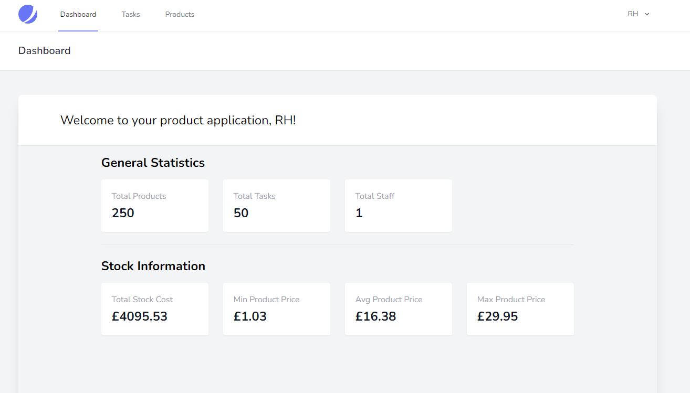
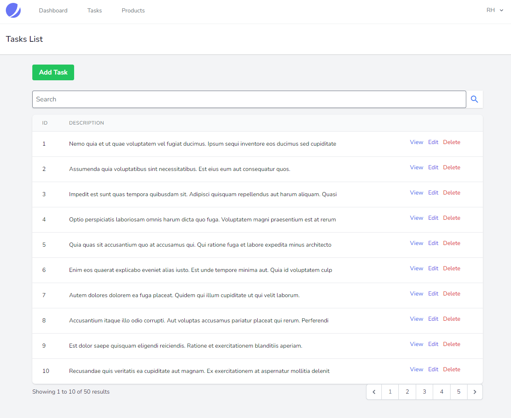

## About this Project

This application is split between 3 main pages.
* Dashboard - Shows statistics regarding tasks, products, users
* Tasks - Shows Tasks in a modern table. Able to create, update, read, edit, delete, search tasks.
* Products - Shows Products in a modern table. Able to create, update, read, edit, delete, search Products.
* Extras: Home page, Login & Register pages and profile settings.

This project was completed in my final year of University for the Advanced Web Engineering Module. It took two sprints to complete following the SCRUM Framework and at the end of each sprint a Retrospective was completed.

However, to refresh my memory I had recreated the application and improving upon it.

## Features this Application has used:

* MVC
* Routes
* Database & Migrations
* Eloquent
* Factories & Seeders
* Laravel Jetstream for Authentication
* Tailwind CSS for greater variety on CSS
* Blade Templating Engine

## Dashboard Statistics

## Tasks Screenshot

## Tasks Edit Form

## Tasks Create Form

## Products Index Table

## Products Create Form

## Tasks Edit Form

## Products View Table

